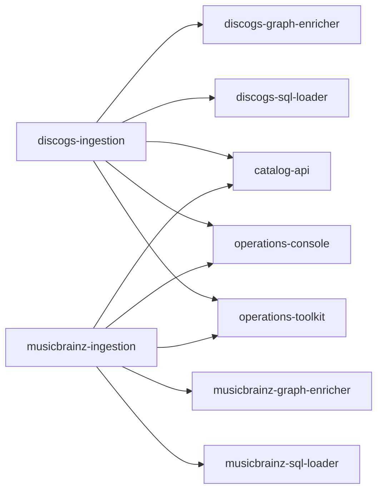

# Public repository catalog

[`repositories.json`](repositories.json) is the public, machine-readable map of GrooveMap's
21 repositories. As of 2026-09-12, 19 are public and the `infra` and `planning-archive`
boundaries are private. The catalog records what each repository is for, how repositories
relate, what they release, their destination visibility, and their current publication
state.

The catalog is intentionally not an infrastructure inventory. It excludes provider identifiers, access controls, team permissions, branch-rule identifiers, secret distribution, environment values, source-extraction paths, and unpublished planning state. Those values belong to private operational systems and must not be represented here, even as redacted placeholders.

[`repositories.schema.json`](repositories.schema.json) is the closed JSON Schema 2020-12 contract. `just catalog` validates the schema, the synthetic fixture, the canonical document, its exact repository set, relationship targets, sorting, and the public-field allowlist.

Publication status describes the observed repository state, not a request for an
infrastructure change. The canonical validator fixes the current 19-public/2-private set and
also rejects coordination edges between the two source-owned ingestion producers.

## Catalog ingestion lineage

The former `catalog-ingestion` repository is represented by two source-owned producers:
`discogs-ingestion` retains the renamed repository's history, while
`musicbrainz-ingestion` starts with a new repository and hive identity. Historical records
that name `catalog-ingestion` remain historical facts and are not bulk-rewritten. The
maintained decision and compatibility boundary are recorded in
[ADR 0005](../docs/adr/0005-source-owned-catalog-ingestion.md).

The current graph below is intentionally independent by source: each producer publishes to
its own consumers, while catalog-level services compose both source contracts. It does not
include the historical health-advisory edge preserved and superseded in ADR 0005.

