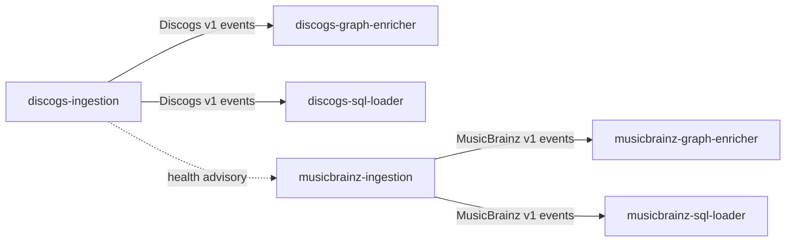

# ADR 0005: Source-owned catalog ingestion repositories

- Status: Accepted

## Context

The combined `catalog-ingestion` repository publishes two independently sourced event
streams. Discogs and MusicBrainz have different acquisition formats, entity vocabularies,
state roots, consumers, and release risk, while the shared repository makes either source's
change part of one image and one release boundary. The split must improve ownership without
changing the established v1 wire contract or the deployment identities on which operators
and consumers depend.

## Decision

### Repository lineage and ownership

Rename the existing `catalog-ingestion` repository to `discogs-ingestion`. Its Git history,
tags, releases, issues, and Beadhive lineage move with the rename; historical references to
`catalog-ingestion` remain valid records and are not rewritten. Existing historical bead
identifiers remain immutable. The renamed hive becomes the Discogs hive.

Create `musicbrainz-ingestion` as a new repository with a freshly initialized Beadhive
project and hive identity. Do not clone the Discogs project identifier, issue database, or
historical bead namespace into it. Seed its source from the reviewed split revision and
record that revision in its initial provenance.

Each producer owns its source-specific acquisition, parsing, normalization, orchestration,
tests, contract manifest, generated bindings, deterministic fixtures, image, and release.
`discogs-ingestion` owns the Discogs extraction rules. `musicbrainz-ingestion` owns the
MusicBrainz-to-Discogs health coordination behavior.

### Frozen compatibility boundary

The source-owned contracts compose to the existing `groovemap.catalog-events` v1 contract.
The event envelope remains unversioned on the wire and keeps these three shapes:

- data: `type`, `id`, and `sha256`, with source-specific additive fields;
- file completion: `type`, `data_type`, `timestamp`, `total_processed`, and `file`; and
- extraction completion: `type`, `version`, `timestamp`, `started_at`, and
  `record_counts`.

Exchanges remain durable fanout exchanges named `{exchange_prefix}-{entity}`. Discogs keeps
the `groovemap-discogs` prefix and the `artists`, `labels`, `masters`, and `releases`
entities. MusicBrainz keeps the `groovemap-musicbrainz` prefix and the `artists`, `labels`,
`release-groups`, and `releases` entities. Consumer queues remain
`{exchange_prefix}-{consumer}-{entity}`, with `.dlx` and `.dlq` suffixes for their dead-letter
exchange and queue. The registered consumers remain `graphinator` and `tableinator` for
Discogs, and `brainzgraphinator` and `brainztableinator` for MusicBrainz.

Deployment keeps the Compose service, container, and hostname identities
`extractor-discogs` / `groovemap-extractor-discogs` and
`extractor-musicbrainz` / `groovemap-extractor-musicbrainz`. Both services keep port 8000
and `GET /health`, `GET /ready`, `GET /metrics`, and `POST /trigger`; trigger requests retain
the optional `force_reprocess` boolean and their accepted/conflict semantics.

Discogs keeps the `discogs_data` volume mounted at `/discogs-data` and its
`extractor_discogs_logs` volume. MusicBrainz keeps the `musicbrainz_data` volume mounted at
`/musicbrainz-data` and its `extractor_musicbrainz_logs` volume. Existing marker names, JSON
fields, phase states, legacy loading behavior, source-byte provenance, file-granular resume,
and durable-write semantics remain compatible.

A file remains complete only after its `file_complete` event is broker-accepted. An
extraction remains complete only after every file succeeds and `extraction_complete` is
broker-accepted. Producer completion must continue to precede the durable completed marker.

Before every initial, periodic, or triggered MusicBrainz run, MusicBrainz continues to poll
Discogs health. A `running` response delays the run; idle, waiting, completed, or failed
allows it. Unreachable health retries ten times with escalating delay from five seconds up
to five minutes and then fails open; an unparseable response fails open immediately. All
waits remain shutdown-aware. This is scheduling preference, not distributed exclusion.

### Cutover and rollback

Rehearse each new image against an isolated broker with source-matching consumers and compare
the frozen fixtures, exchange/queue declarations, completion ordering, marker restart, health,
trigger, and shutdown behavior before production cutover.

Cut over one source at a time. Stop the old source mode, verify it is no longer publishing,
deploy the matching source-owned image by immutable digest, and observe its consumers before
starting the other source's cutover. Never dual-run an old and new producer for the same
source against production exchanges: duplicated data and completion events would make parity
evidence ambiguous and consume retry budgets.

Rollback is also source-local: stop the new producer, verify quiescence, and restore the last
known-good combined image digest for that source with the same service name, endpoints,
volumes, exchanges, queues, and markers. A mutable tag is not a rollback target.

### Shared implementation

Small mechanisms used by both Rust producers, including batching, AMQP publication, health
and trigger handling, state persistence, polite HTTP behavior, and shutdown helpers, are
copied into each repository and evolve locally. No third shared Rust crate and no third
contract repository are introduced. At this scale, source-local duplication keeps validation,
release, rollback, and ownership atomic; a shared package would couple both producers to a
third release train without removing their source-specific behavior.

## Consequences

Each event stream has one producer, contract owner, image, release, and rollback boundary.
Consumers promote artifacts only from their matching producer, while services that compose
the full catalog can pin both source contracts explicitly. Compatibility is intentionally
conservative during the split; future breaking changes require a new contract version and a
coordinated producer/consumer rollout.
